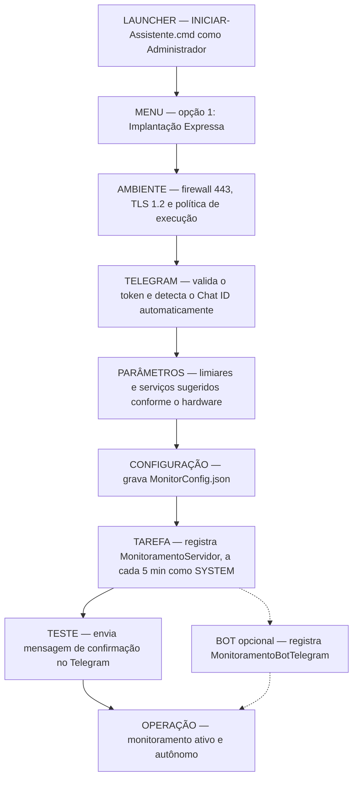
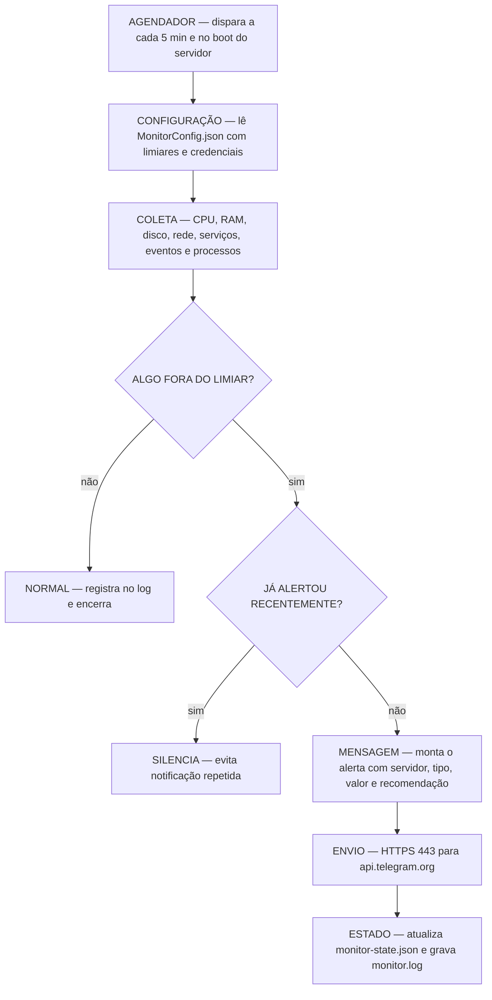
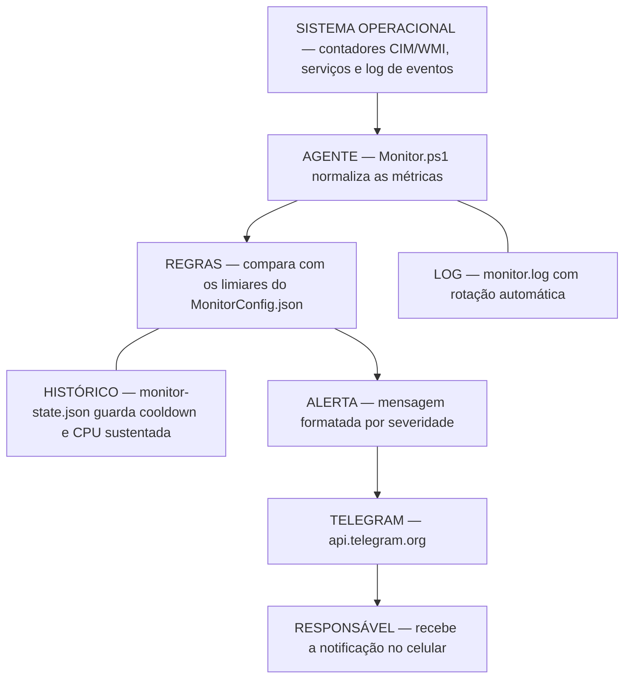
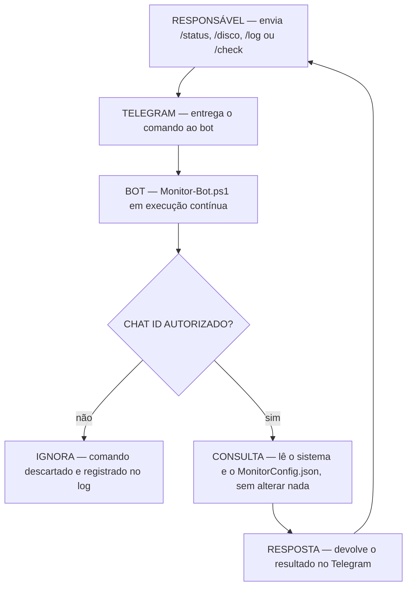

# VigiaBOT

Monitoramento de servidores Windows com alertas via Telegram e assistente
interativo de implantação. O agente roda como tarefa agendada na conta `SYSTEM`,
coleta indicadores a cada 5 minutos e avisa apenas quando algo foge do esperado.

<p align="left">
  <a href="LICENSE">
    
  </a>
  <a href="CHANGELOG.md">
    
  </a>
  <a href="#requisitos">
    
  </a>
  <a href="#requisitos">
    
  </a>
</p>

---

## Sumário

| Seção | Conteúdo |
|-------|----------|
| [Visão geral](#visão-geral) | O que é e como funciona |
| [Funcionalidades](#funcionalidades) | O que é monitorado |
| [Requisitos](#requisitos) | Condições mínimas |
| [Início rápido](#início-rápido) | Instalação em 3 passos |
| [Arquitetura da solução](#arquitetura-da-solução) | Fluxos, componentes e dados |
| [Guia de utilização](#guia-de-utilização) | 15 tópicos passo a passo |
| [Boas práticas e recomendações](#boas-práticas-e-recomendações) | Recomendações de uso |
| [Roadmap](#roadmap) | Próximos passos |
| [Contribuição](#contribuição) | Como colaborar |
| [Changelog](#changelog) | Histórico de versões |
| [Licença](#licença) · [Créditos](#créditos) | Projeto |

Atalhos do guia:
[1. Pré-requisitos](#1-pré-requisitos) ·
[2. Instalação](#2-instalação) ·
[3. Primeira execução](#3-primeira-execução) ·
[4. Diretórios](#4-estrutura-de-diretórios) ·
[5. Configuração](#5-arquivo-de-configuração) ·
[6. Servidores](#6-como-cadastrar-servidores) ·
[7. Telegram](#7-como-configurar-o-telegram) ·
[8. Alertas](#8-como-configurar-os-alertas) ·
[9. Iniciar](#9-como-iniciar-o-monitoramento) ·
[10. Parar](#10-como-parar-o-serviço) ·
[11. Atualizar](#11-como-atualizar-a-ferramenta) ·
[12. Logs](#12-como-visualizar-logs) ·
[13. Interpretar alertas](#13-como-interpretar-os-alertas) ·
[14. Manutenção](#14-como-realizar-manutenção) ·
[15. Desinstalar](#15-como-desinstalar)

---

## Visão geral

O VigiaBOT observa a saúde de um servidor Windows e avisa o responsável pelo
Telegram. Não exige painéis pagos, agentes pesados ou serviços externos.

| Componente | Arquivo | Função |
|------------|---------|--------|
| Agente | `Monitor.ps1` | Coleta métricas e envia alertas. Executa a cada 5 minutos. |
| Bot de comandos | `Monitor-Bot.ps1` | Responde a consultas no Telegram. Opcional. |
| Assistente | `Launcher-Monitoramento.ps1` | Instala, configura e parametriza de forma guiada. |

Toda a parametrização fica em um arquivo externo, o `MonitorConfig.json`, lido
pelo agente a cada execução. Limiares, serviços vigiados e credenciais mudam sem
editar código.

---

## Funcionalidades

| Área | O que é verificado |
|------|--------------------|
| CPU | Uso total sustentado e uso por processo |
| Memória | Percentual de RAM e consumo por processo |
| Disco | Percentual de uso por volume |
| Rede | Conectividade via TCP 443, sem depender de ping |
| Serviços | Serviços críticos nomeados e serviços automáticos parados |
| Sistema | Eventos críticos, processos travados, reinícios inesperados e BSOD |
| Aplicações | Falhas de Backup, Windows Update e bancos de dados |

Recursos de apoio:

- Cooldown por tipo de alerta, evitando notificações repetidas.
- Estado persistente entre execuções.
- Log local com rotação automática.
- Comandos remotos somente leitura: `/status`, `/check`, `/log`, `/servicos`,
  `/disco`, `/uptime`, `/help`.

---

## Requisitos

| Item | Requisito |
|------|-----------|
| Sistema operacional | Windows Server 2012 R2 a 2022, ou Windows 10/11 |
| PowerShell | Windows PowerShell 5.1 ou PowerShell 7 |
| Privilégios | Administrador para instalar; a tarefa roda como `SYSTEM` |
| Rede | Saída HTTPS para `api.telegram.org` na porta 443 |
| Telegram | Bot criado no [@BotFather](https://t.me/BotFather) e o Chat ID de destino |

Verificação detalhada no [passo 1](#1-pré-requisitos).

---

## Início rápido

1. Baixe o projeto no servidor: `git clone https://github.com/edsilas/VigiaBOT.git`
2. Abra a pasta `src` e dê duplo-clique em `INICIAR-Assistente.cmd` (a elevação
   via UAC é solicitada automaticamente).
3. No menu, escolha a opção **1 — Implantação Expressa** e siga as instruções.

Ao final, uma mensagem de teste chega no seu Telegram. O passo a passo completo
está no [guia de utilização](#guia-de-utilização).

---

## Arquitetura da solução

### Princípio central

O agente lê um arquivo de configuração externo e o aplica sobre seus valores
padrão. O assistente nunca edita o código do agente: ele apenas grava esse
arquivo. Isso garante compatibilidade total e atualizações seguras.

### Fluxo de implantação

Do duplo-clique até o primeiro alerta funcionando.



### Ciclo de execução do agente

O Agendador dispara o agente a cada 5 minutos. Cada execução é curta e
independente: lê, coleta, compara, decide e encerra.



### Fluxo dos dados, da coleta ao alerta



### Consultas sob demanda pelo bot

O bot é opcional, somente leitura e responde apenas a Chat IDs autorizados.



### Responsabilidade de cada arquivo

| Arquivo | Responsabilidade |
|---------|------------------|
| `Monitor.ps1` | Núcleo. Coleta métricas, aplica limiares e envia alertas. |
| `Monitor-Bot.ps1` | Escuta comandos do Telegram e responde consultas, somente leitura. |
| `Install-Monitor.ps1` | Registra, remove ou testa a tarefa agendada do agente. |
| `Launcher-Monitoramento.ps1` | Assistente interativo que orquestra a implantação. |
| `INICIAR-Assistente.cmd` | Atalho de duplo-clique que eleva o assistente via UAC. |
| `MonitoramentoServidor.xml` | Definição da tarefa agendada: gatilhos e conta. |
| `Preparar-Ambiente.cmd` | Ajusta firewall 443, TLS 1.2 e política de execução. |
| `Atualizar-Agendador.cmd` | Reregistra as tarefas após uma atualização. |
| `Agendar-Bot.cmd` | Agenda o bot para iniciar junto com o Windows. |

### Função de cada diretório

| Diretório | Função |
|-----------|--------|
| `src/` | Tudo o que é copiado para o servidor. Os arquivos devem permanecer juntos: são localizados por caminho relativo. |
| `docs/` | Manuais e guias de apoio. Não interfere na execução. |
| Raiz | Metadados do projeto: licença, changelog e guia de contribuição. |

### Relacionamento entre os componentes

| Origem | Destino | Interação |
|--------|---------|-----------|
| Assistente | `MonitorConfig.json` | Grava limiares e credenciais |
| Assistente | Agendador de Tarefas | Registra as tarefas do agente e do bot |
| `Monitor.ps1` | `MonitorConfig.json` | Lê a configuração a cada execução |
| `Monitor.ps1` | `monitor-state.json` | Guarda cooldown e estado entre execuções |
| `Monitor.ps1` | Telegram | Envia alertas, saída HTTPS 443 |
| `Monitor-Bot.ps1` | `MonitorConfig.json` | Lê token, Chat IDs e serviços |
| `Monitor-Bot.ps1` | Telegram | Recebe comandos e responde |

### Sequência de execução

1. O operador executa `INICIAR-Assistente.cmd`, que se eleva via UAC.
2. O assistente prepara o ambiente, grava o `MonitorConfig.json` e registra as tarefas.
3. A tarefa `MonitoramentoServidor` dispara `Monitor.ps1` a cada 5 minutos e no boot.
4. Quando instalada, a tarefa `MonitoramentoBotTelegram` mantém o bot em execução.
5. O agente envia alertas automáticos; o bot responde a consultas sob demanda.

## Guia de utilização

Este guia foi escrito para quem nunca usou a ferramenta. Cada comando vem
acompanhado do motivo pelo qual é executado, do que ele faz e do que esperar
depois. Recomenda-se a instalação pelo assistente; os comandos manuais existem
para quem preferir controle total.

> Convenção: sempre que aparecer "PowerShell como Administrador", significa
> clicar com o botão direito no menu Iniciar, escolher "Windows PowerShell
> (Admin)" ou "Terminal (Admin)" e responder "Sim" à janela de permissão (UAC).

### 1. Pré-requisitos

**Objetivo:** garantir que o servidor atende às condições mínimas antes de instalar.

**Explicação:** o VigiaBOT usa apenas recursos nativos do Windows. Você só
precisa confirmar a versão do PowerShell, ter direitos de administrador e uma
saída de internet para o Telegram.

**Comandos de verificação** (PowerShell como Administrador):

```powershell
# Por que: confirmar a versão do PowerShell (precisa ser 5.1 ou superior).
# O que faz: imprime a versão instalada.
$PSVersionTable.PSVersion

# Por que: confirmar que o servidor alcança o Telegram na porta 443.
# O que faz: testa a conexão TCP com a API do Telegram.
Test-NetConnection api.telegram.org -Port 443
```

**Exemplo de saída esperada:**

```
Major  Minor  Build  Revision
-----  -----  -----  --------
5      1      19041  4291

ComputerName     : api.telegram.org
RemotePort       : 443
TcpTestSucceeded : True
```

**Observações importantes:**

- `TcpTestSucceeded : True` indica que a rede está liberada. É o item mais crítico.
- Não é necessário abrir portas de entrada; o servidor apenas faz conexões de saída.

**Solução de erros comuns:**

- `TcpTestSucceeded : False`: a porta 443 está bloqueada. Libere a saída no
  firewall/proxy da rede ou use o passo [Preparar ambiente](#9-como-iniciar-o-monitoramento).
- Versão do PowerShell inferior a 5.1: atualize o Windows Management Framework
  ou instale o PowerShell 7.

### 2. Instalação

**Objetivo:** colocar os arquivos no servidor e iniciar o assistente.

**Explicação:** basta copiar a pasta do projeto para o servidor e executar um
único atalho. O assistente cuida do restante.

**Passos:**

1. Baixe o projeto (botão "Code" no GitHub ou `git clone`) e copie a pasta para
   o servidor, por exemplo em `C:\Instaladores\VigiaBOT`.

   ```bash
   git clone https://github.com/edsilas/VigiaBOT.git
   ```

2. Abra a pasta `src`.
3. Dê **duplo-clique** em `INICIAR-Assistente.cmd`.

**O que esperar:** uma janela de permissão do Windows (UAC) aparece; clique em
"Sim". Em seguida abre o menu do assistente.

**Observações importantes:**

- Mantenha todos os arquivos de `src` juntos, na mesma pasta. Eles dependem
  disso para funcionar.
- Você não precisa alterar a política de execução do Windows manualmente; o
  atalho já executa o assistente de forma isolada e segura.

**Solução de erros comuns:**

- A janela abre e fecha na hora: execute pela linha de comando para ver a
  mensagem — abra o PowerShell como Administrador na pasta `src` e rode
  `powershell -ExecutionPolicy Bypass -File .\Launcher-Monitoramento.ps1`.
- "Este arquivo veio de outro computador" (bloqueio do Windows): clique com o
  botão direito no arquivo, Propriedades, marque "Desbloquear" e aplique.

### 3. Primeira execução

**Objetivo:** deixar o monitoramento funcionando de ponta a ponta na primeira vez.

**Explicação:** no menu do assistente, a opção 1 (Implantação Expressa) executa
todas as etapas em sequência: prepara o ambiente, configura o Telegram,
sugere os limiares, instala a tarefa e envia uma mensagem de teste.

**Menu do assistente:**

```
[1] Implantacao Expressa (recomendado) - configura tudo, guiado
[2] Configurar Telegram (token + deteccao automatica do Chat ID)
[3] Parametrizacao inteligente (limiares e servicos sugeridos)
[4] Preparar ambiente (firewall 443, TLS 1.2, ExecutionPolicy)
[5] Instalar / atualizar tarefa de monitoramento (5 min)
[6] Instalar / atualizar bot de comandos (opcional)
[7] Testar agora (diagnostico + mensagem no Telegram)
[8] Painel de status (tarefas, config efetiva, log)
[9] Remover / Rollback
[0] Sair
```

**Passo a passo:** digite `1` e tecle Enter. Siga as instruções na tela: informe
o token do bot e envie uma mensagem ao seu bot quando solicitado (o assistente
lê o Chat ID sozinho).

**O que esperar:** ao final, você recebe uma mensagem de teste no Telegram
confirmando que tudo está funcionando.

**Observações importantes:**

- Se preferir controlar cada etapa, use as opções de 2 a 7 na ordem apresentada.
- A opção 6 (bot de comandos) é opcional e pode ser instalada depois.

**Solução de erros comuns:**

- Não chega mensagem de teste: verifique o token (passo 7) e se você enviou pelo
  menos uma mensagem ao bot antes da detecção do Chat ID.
- Erro de conectividade: refaça o passo 1 e, se necessário, a opção 4 do menu.

### 4. Estrutura de diretórios

**Objetivo:** saber onde ficam os arquivos após a instalação.

**Explicação:** por padrão, o assistente instala tudo em `C:\Monitoramento`.
É lá que ficam a configuração, o estado e os logs.

```
C:\Monitoramento\
|-- Monitor.ps1                Agente de monitoramento
|-- Monitor-Bot.ps1            Bot de comandos (se instalado)
|-- Install-Monitor.ps1        Instalador da tarefa
|-- MonitoramentoServidor.xml  Definição da tarefa
|-- MonitorConfig.json         Configuração e segredos (NÃO versionar)
|-- monitor-state.json         Estado interno do agente
|-- bot-state.json             Controle interno do bot
`-- logs\
    |-- monitor.log            Log do agente
    `-- bot.log                Log do bot
```

**Observações importantes:**

- `MonitorConfig.json` pode conter o token do Telegram. A pasta é restrita a
  administradores; não copie esse arquivo para locais públicos nem para o Git.
- Os logs giram automaticamente quando atingem o tamanho máximo, então não
  crescem indefinidamente.

**Solução de erros comuns:**

- A pasta não existe: a instalação não foi concluída. Reabra o assistente e use
  a opção 5 (Instalar tarefa) ou a opção 1 (Implantação Expressa).

### 5. Arquivo de configuração

**Objetivo:** entender e ajustar o `MonitorConfig.json`.

**Explicação:** este arquivo define como o agente se comporta. O agente lê os
valores padrão internos e aplica por cima o que estiver nesse arquivo. Você só
precisa colocar aquilo que quiser mudar.

**Exemplo de `MonitorConfig.json`:**

```json
{
  "TelegramToken": "SEU_TOKEN_AQUI",
  "TelegramChatId": "SEU_CHAT_ID_AQUI",
  "CpuThreshold": 85,
  "RamThreshold": 85,
  "DiskThreshold": 90,
  "CriticalServices": ["MSSQLSERVER", "W3SVC", "Spooler"],
  "MonitorAutoStopped": true
}
```

**Parâmetros mais usados:**

| Parâmetro | Padrão | O que controla |
|-----------|:------:|----------------|
| `CpuThreshold` | 80 | Percentual de CPU que dispara alerta |
| `CpuSustainMinutes` | 5 | Minutos sustentados acima do limiar antes de alertar |
| `RamThreshold` | 80 | Percentual de memória RAM |
| `DiskThreshold` | 90 | Percentual de uso por volume de disco |
| `ProcCpuThreshold` | 70 | Percentual de CPU de um único processo |
| `ProcMemThresholdMB` | 2048 | Memória (MB) de um único processo |
| `AlertCooldownMin` | 30 | Intervalo mínimo para repetir o mesmo alerta |
| `CriticalServices` | `["Spooler"]` | Serviços nomeados que serão vigiados |
| `MonitorAutoStopped` | `true` | Vigiar todos os serviços automáticos parados |

**Observações importantes:**

- Após alterar limiares, não é preciso reiniciar nada: o agente relê o arquivo
  na próxima execução (no máximo 5 minutos depois).
- Use aspas duplas e vírgulas corretas; é um arquivo JSON.

**Solução de erros comuns:**

- O agente parou de alertar após uma edição: o JSON provavelmente está inválido.
  Valide-o (por exemplo, colando em um validador de JSON) e corrija vírgulas ou
  aspas. Em caso de dúvida, use a opção 3 do assistente para regenerá-lo.

### 6. Como cadastrar servidores

**Objetivo:** entender o modelo de vários servidores.

**Explicação:** o VigiaBOT é um agente por servidor. Não existe um cadastro
central: cada servidor roda a sua própria cópia e envia alertas para o Telegram.
Para monitorar vários servidores, instale a ferramenta em cada um deles.

**Como identificar de qual servidor veio o alerta:** toda mensagem inclui o nome
da máquina (COMPUTERNAME). Assim você distingue os servidores mesmo usando o
mesmo Telegram.

**Recomendações para vários servidores:**

- Use o mesmo bot do Telegram para todos e um grupo como destino, ou um Chat ID
  por equipe. O nome da máquina no alerta identifica a origem.
- Repita a instalação (passos 2 e 3) em cada servidor.
- Se quiser padronizar limiares, copie o mesmo `MonitorConfig.json` para cada
  servidor (sem os segredos, se preferir defini-los por variável de ambiente).

**Observações importantes:**

- Cada servidor mantém seus próprios logs e estado localmente.
- Não é necessário que os servidores se comuniquem entre si.

### 7. Como configurar o Telegram

**Objetivo:** criar o bot, obter o token e o Chat ID de destino.

**Explicação:** o Telegram entrega os alertas. Você precisa de um "bot" (criado
gratuitamente) e do identificador do destino (seu usuário ou um grupo).

**Passo a passo:**

1. No Telegram, abra o [@BotFather](https://t.me/BotFather) e envie `/newbot`.
   Siga as instruções e guarde o **token** informado (algo como
   `123456789:AAE...`).
2. Envie uma mensagem qualquer ao seu novo bot (isso é necessário para o passo
   seguinte).
3. No assistente, escolha a opção 2 (Configurar Telegram), informe o token e
   deixe a **detecção automática** ler o seu Chat ID.

**Configuração manual (alternativa):** coloque o token e o Chat ID diretamente
no `MonitorConfig.json` (ver [passo 5](#5-arquivo-de-configuração)).

**Observações importantes:**

- Para enviar a um grupo, adicione o bot ao grupo e envie uma mensagem lá antes
  da detecção; os IDs de grupo são números negativos.
- O token é uma credencial sensível. Trate-o como uma senha.

**Solução de erros comuns:**

- Detecção não encontra o Chat ID: envie uma mensagem ao bot e tente de novo.
- Token recusado: confirme que copiou o valor completo, sem espaços.

### 8. Como configurar os alertas

**Objetivo:** ajustar quando e sobre o que você quer ser avisado.

**Explicação:** os alertas são controlados pelos limiares e pela lista de
serviços no `MonitorConfig.json`. A opção 3 do assistente sugere valores com
base no hardware do servidor.

**Duas formas de configurar:**

```
Assistente (recomendado):  opção 3 - Parametrização inteligente
Manual:                    editar MonitorConfig.json (ver passo 5)
```

**Recomendações práticas:**

- Em servidores de banco de dados, inclua o serviço do banco em
  `CriticalServices` (por exemplo, `MSSQLSERVER`).
- Em servidores com muitos serviços que iniciam sob demanda, considere
  `MonitorAutoStopped: false` para reduzir ruído.
- Aumente `AlertCooldownMin` se estiver recebendo alertas repetidos com muita
  frequência.

**Observações importantes:**

- Mudanças de limiar valem na próxima execução do agente (até 5 minutos).
- Mudanças que afetam o bot (por exemplo, serviços críticos) exigem reiniciar a
  tarefa do bot (ver [passo 10](#10-como-parar-o-serviço)).

### 9. Como iniciar o monitoramento

**Objetivo:** registrar (ou reativar) a tarefa que executa o agente a cada 5 minutos.

**Explicação:** o monitoramento é uma tarefa agendada. Instalá-la faz o Windows
executar o agente automaticamente, mesmo sem ninguém logado.

**Pela via recomendada:** no assistente, use a opção 5 (Instalar / atualizar
tarefa). Se ainda não preparou o ambiente, use antes a opção 4.

**Comandos manuais** (PowerShell como Administrador, na pasta de instalação):

```powershell
# Por que: preparar firewall, TLS 1.2 e política de execução (uma única vez).
# O que faz: aplica os ajustes de ambiente necessários.
.\Preparar-Ambiente.cmd

# Por que: registrar a tarefa agendada do agente.
# O que faz: cria a tarefa "MonitoramentoServidor" que roda a cada 5 minutos.
.\Install-Monitor.ps1 -Install

# Por que: executar uma vez imediatamente para confirmar o funcionamento.
# O que faz: dispara a tarefa agora, sem esperar os 5 minutos.
schtasks /Run /TN MonitoramentoServidor
```

**Exemplo de saída esperada:**

```
SUCCESS: Attempted to run the scheduled task "MonitoramentoServidor".
```

**Observações importantes:**

- A tarefa também dispara na inicialização do servidor (gatilho de boot).
- Para instalar o bot de comandos, use a opção 6 do assistente.

**Solução de erros comuns:**

- "Access is denied": você não está como Administrador. Reabra o PowerShell com
  "Executar como administrador".
- A tarefa não aparece: confirme o nome com `schtasks /Query /TN MonitoramentoServidor`.

### 10. Como parar o serviço

**Objetivo:** pausar temporariamente o monitoramento ou o bot.

**Explicação:** o agente é disparado por uma tarefa; o bot roda continuamente.
Você pode desativar a tarefa do agente e encerrar o processo do bot sem
desinstalar nada.

**Comandos** (PowerShell como Administrador):

```powershell
# Por que: pausar o monitoramento sem remover a instalação.
# O que faz: desativa a tarefa; ela para de disparar até ser reativada.
schtasks /Change /TN MonitoramentoServidor /DISABLE

# Por que: reativar quando quiser voltar a monitorar.
# O que faz: reativa a tarefa do agente.
schtasks /Change /TN MonitoramentoServidor /ENABLE

# Por que: parar o bot de comandos (se instalado).
# O que faz: encerra a execução atual do bot.
schtasks /End /TN MonitoramentoBotTelegram
```

**Observações importantes:**

- Desativar a tarefa do agente não apaga configuração nem logs.
- O bot volta a iniciar no próximo boot, pois está agendado para iniciar com o
  Windows. Para impedir isso de forma permanente, desinstale (passo 15).

**Solução de erros comuns:**

- "The system cannot find the file specified": a tarefa não existe com esse
  nome. Liste as tarefas com `schtasks /Query | findstr /i Monitoramento`.

### 11. Como atualizar a ferramenta

**Objetivo:** aplicar uma nova versão preservando a configuração.

**Explicação:** atualizar é substituir os scripts pela versão nova e reregistrar
as tarefas. A configuração (`MonitorConfig.json`), o estado e os logs são
preservados.

**Passo a passo:**

1. Baixe a nova versão do projeto.
2. Copie os arquivos de `src` para a pasta de instalação (`C:\Monitoramento`),
   substituindo os antigos. **Não** substitua o `MonitorConfig.json`.
3. Reregistre as tarefas:

```powershell
# Por que: garantir que a tarefa aponte para os scripts atualizados.
# O que faz: reregistra as tarefas de monitoramento.
.\Atualizar-Agendador.cmd

# Por que: aplicar a atualização do bot (se estiver em uso).
# O que faz: reinicia o bot para carregar o código novo.
schtasks /End /TN MonitoramentoBotTelegram
schtasks /Run /TN MonitoramentoBotTelegram
```

**Observações importantes:**

- Mantenha um backup do `MonitorConfig.json` antes de grandes atualizações.
- Confira o `CHANGELOG.md` da nova versão para mudanças relevantes.

**Solução de erros comuns:**

- O bot continua com o comportamento antigo: você atualizou o arquivo mas não
  reiniciou a tarefa. Rode os dois comandos `schtasks /End` e `schtasks /Run`.

### 12. Como visualizar logs

**Objetivo:** acompanhar o que a ferramenta está fazendo.

**Explicação:** o agente e o bot registram suas ações em arquivos de log. Você
pode lê-los diretamente ou consultá-los pelo Telegram.

**Comandos** (PowerShell):

```powershell
# Por que: ver as últimas linhas do log do agente.
# O que faz: mostra as 30 linhas finais e continua acompanhando em tempo real.
Get-Content C:\Monitoramento\logs\monitor.log -Tail 30 -Wait

# Por que: ver o log do bot de comandos.
# O que faz: mostra as últimas linhas do log do bot.
Get-Content C:\Monitoramento\logs\bot.log -Tail 30
```

**Pelo Telegram:** envie `/log` ao bot para receber as últimas linhas do log do
agente. Pelo assistente, a opção 8 (Painel de status) também exibe um resumo.

**Observações importantes:**

- Os logs giram automaticamente ao atingir o tamanho máximo; arquivos antigos
  ficam com extensão `.bak`.
- Pressione `Ctrl+C` para sair do modo de acompanhamento (`-Wait`).

**Solução de erros comuns:**

- "log ainda não gerado" no `/log`: o agente ainda não executou ou está em outra
  pasta. Rode `schtasks /Run /TN MonitoramentoServidor` e aguarde um minuto.

### 13. Como interpretar os alertas

**Objetivo:** entender rapidamente o que cada alerta significa.

**Explicação:** os alertas indicam o tipo de problema, o valor observado e o
servidor de origem. A tabela abaixo resume os principais.

| Alerta | Significado | Primeira ação sugerida |
|--------|-------------|------------------------|
| CPU alta sustentada | CPU acima do limiar por vários minutos | Identificar o processo que consome CPU |
| RAM alta | Uso de memória acima do limiar | Verificar processos e vazamentos de memória |
| Disco cheio | Volume acima do limiar de uso | Liberar espaço no volume indicado |
| Serviço parado | Um serviço crítico ou automático não está em execução | Reiniciar o serviço e investigar a causa |
| Evento crítico | Registro crítico no Log de Eventos | Consultar o Visualizador de Eventos |
| Reinício inesperado | O servidor reiniciou sem planejamento | Verificar causa (energia, atualização, falha) |
| BSOD | Ocorreu uma tela azul | Analisar o minidump em `C:\Windows\Minidump` |
| Falha de backup/update/banco | Falha detectada nesses componentes | Verificar o serviço ou a rotina correspondente |
| Rede indisponível | Sem conectividade na porta 443 | Checar rede, DNS e firewall de saída |

**Observações importantes:**

- O mesmo alerta não se repete antes do tempo de `AlertCooldownMin`.
- O nome do servidor no início da mensagem identifica a origem.

### 14. Como realizar manutenção

**Objetivo:** manter a ferramenta saudável ao longo do tempo.

**Explicação:** a manutenção é leve. Basta conferir o status periodicamente,
revisar os logs e validar o envio de tempos em tempos.

**Rotina recomendada:**

```powershell
# Por que: confirmar que o envio ao Telegram continua funcionando.
# O que faz: executa um diagnóstico e envia uma mensagem de teste.
.\Install-Monitor.ps1 -Test

# Por que: verificar se a tarefa está ativa e quando rodou pela última vez.
# O que faz: mostra os detalhes da tarefa agendada.
schtasks /Query /TN MonitoramentoServidor /V /FO LIST
```

**Checklist periódico:**

- Revisar `monitor.log` em busca de avisos recorrentes.
- Conferir espaço em disco na pasta de logs (a rotação já limita o tamanho).
- Reavaliar os limiares conforme a carga real do servidor.
- Após mudanças no servidor (novos serviços), atualizar `CriticalServices`.

**Observações importantes:**

- O painel de status (opção 8 do assistente) reúne tarefas, configuração
  efetiva e as últimas linhas de log em um só lugar.

**Solução de erros comuns:**

- `-Test` falha no envio: revise token/Chat ID (passo 7) e a conectividade
  (passo 1).

### 15. Como desinstalar

**Objetivo:** remover completamente o VigiaBOT do servidor.

**Explicação:** a remoção retira as tarefas agendadas e, opcionalmente, as
regras de firewall e as variáveis criadas. A pasta é mantida para você decidir
se apaga.

**Pela via recomendada:** no assistente, use a opção 9 (Remover / Rollback) e
confirme as perguntas.

**Comandos manuais** (PowerShell como Administrador, na pasta de instalação):

```powershell
# Por que: remover a tarefa do agente.
# O que faz: desinstala a tarefa "MonitoramentoServidor".
.\Install-Monitor.ps1 -Uninstall

# Por que: remover a tarefa do bot (se instalado).
# O que faz: encerra e apaga a tarefa do bot.
schtasks /End    /TN MonitoramentoBotTelegram
schtasks /Delete /TN MonitoramentoBotTelegram /F
```

**Observações importantes:**

- A pasta `C:\Monitoramento` (com logs e configuração) é preservada. Apague-a
  manualmente se não precisar mais dos registros.
- Se você definiu o token por variável de ambiente de máquina, a opção 9 do
  assistente também oferece removê-la.

**Solução de erros comuns:**

- Tarefa não encontrada ao remover: ela já foi removida ou tem outro nome.
  Confirme com `schtasks /Query | findstr /i Monitoramento`.

---

## Boas práticas e recomendações

- Instale sempre a partir de uma conta de Administrador, para que a tarefa seja
  registrada corretamente na conta `SYSTEM`.
- Prefira configurar o Telegram pelo assistente: a detecção automática do Chat
  ID evita erros de digitação.
- Trate o token como uma senha. Não o compartilhe nem o inclua em capturas de
  tela ou repositórios.
- Faça um teste (`-Test`) após qualquer mudança de configuração relevante.
- Ajuste os limiares à realidade de cada servidor; valores padrão são um ponto
  de partida, não uma regra fixa.
- Em ambientes de produção, valide a instalação primeiro em um servidor de
  homologação.
- Mantenha um backup do `MonitorConfig.json` antes de atualizações maiores.

---

## Roadmap

- Suporte a múltiplos destinos de alerta (vários Chat IDs ou canais).
- Perfis de parametrização exportáveis entre servidores.
- Canal alternativo de alerta por e-mail (SMTP).
- Painel de status consolidado para conjuntos de servidores.
- Testes automatizados e verificação de estilo do código.

Sugestões são bem-vindas via [issues](https://github.com/edsilas/VigiaBOT/issues).

---

## Contribuição

Contribuições são bem-vindas. O guia completo está em
[CONTRIBUTING.md](CONTRIBUTING.md). Em resumo:

1. Abra uma issue descrevendo o problema ou a proposta.
2. Crie um branch a partir de `main` (`feat/...`, `fix/...`, `docs/...`).
3. Mantenha os padrões do projeto: compatibilidade com PowerShell 5.1 e 7,
   scripts em ASCII e nenhum segredo no commit.
4. Valide em homologação e abra um Pull Request claro, referenciando a issue.

---

## Changelog

### Versão 1.0.2 — 2026-07-15

- Correção no cálculo de uso de CPU por processo, que podia ultrapassar 100% em
  servidores sobrecarregados. O agente passou a medir o tempo real decorrido por
  processo (cronômetro monotônico) em vez de presumir um intervalo fixo, e o
  valor é limitado a 100%. Sem alteração de funcionalidades.

### Versão 1.0.1 — 2026-07-08

- Correção do robô de comandos do Telegram, que não respondia quando os segredos
  eram definidos pelo modo padrão do assistente. O bot passou a ler o mesmo
  `MonitorConfig.json` do agente, resolve o caminho do log de forma robusta e
  entrega respostas em texto simples caso o envio em HTML falhe. Sem regressões.

### Versão 1.0.0 — 2026-07-04

- Primeira versão pública: agente de monitoramento, bot de comandos, instalador
  da tarefa agendada e assistente interativo de implantação, com documentação
  técnica completa.

O histórico detalhado está em [CHANGELOG.md](CHANGELOG.md).

---

## Licença

Distribuído sob a Apache License 2.0. Consulte o arquivo [LICENSE](LICENSE) para
o texto completo.

```
Copyright © 2026 Edsilas

Licensed under the Apache License, Version 2.0 (the "License");
you may not use this file except in compliance with the License.
You may obtain a copy of the License at

    http://www.apache.org/licenses/LICENSE-2.0
```

---

## Créditos

Desenvolvido por Edsilas.
